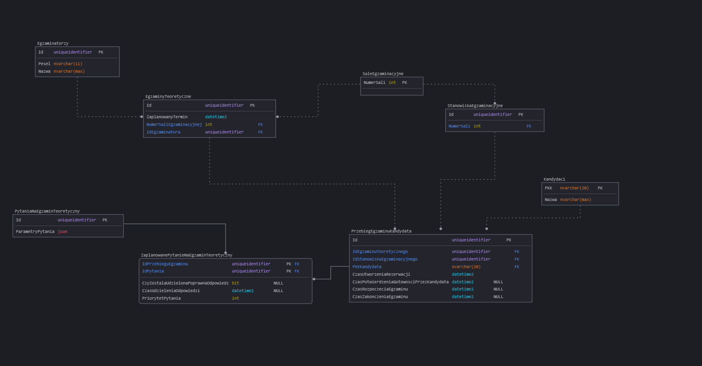

# Specyfikacja wymagań procesu: Przeprowadzenie egzaminu teoretycznego

## Generalny opis procesu

### Opis procesu

Proces przeprowadzenia egzaminu teoretycznego składa się z następujących kroków:

- Kandydat wybiera dostępny termin egzaminu teoretycznego oraz rejestruje się na egzamin.
- Kandydat przychodzi na egzamin w wyznaczonym terminie.
- Kandydat podchodzi do egzaminu na komputerze stacjonarnym w sali w towarzystwie innych kandydatów pod nadzorem egzaminatora.
- W momencie gdy zostanie zakończony przez wszystkich obecnych na sali kandydatów, system automatycznie ocenia testy, pokazuje kandydatowi wynik oraz egzaminator drukuje zaświadczenia o wyniku egzaminu.
- Kandydat otrzymuje wynik egzaminu oraz zaświadczenie o wyniku egzaminu.
- W przypadku nieprawidłowości w przebiegu egzaminu, kandydat ma prawo złożyć skargę poprzez wypełnienie formularza w okienku recepcji.

Cele dot. procesu:

- **Zmniejszenie średniego czasu oczekiwania na termin egzaminu teoretycznego o nie mniej niż 3% miesięcznie w porównaniu do poprzedniego miesiąca przez okres następnych 18 miesięcy**
- **Zmniejszenie liczby skarg dot. przebiegu egzaminu teoretycznego o min 75% w skali najbliższych 18 miesięcy (z 500 do mniej niż, lub równo 125)**

### Pytania analityczne

### Źródła danych

Dane dotyczące przebiegu egzaminu teoretycznego są przechowywane w bazie danych systemu przeprowadzania egzaminów teoretycznych. System przechowuje informacje o kandydatach, egzaminatorach, wynikach egzaminów oraz czasie / terminie jego przeprowadzenia. Przechowywane są również informacje o incydentach, które miały miejsce podczas egzaminu.

Skargi dot. procesu egzaminacyjnego są przepisywane z formularzy skargowych do pliku excel przez pracownika recepcji. Plik ten rotowany jest co miesiąc oraz przekazywany do kierownictwa co 2 tygodnie.

## Struktury w źródłach danych

### Baza danych systemu przeprowadzania egzaminów teoretycznych

| Nazwa tabeli | Atrybut | Typ atrybutu | Opis |
| ------------ | ------- | ------------ | ---- |
|              |         |              |      |
|              |         |              |      |

### Plik excel z danymi dot. skarg

_Arkusz 1_ - Skargi dot. procesu egzaminacyjnego.

Kolumna A - PKK Kantydanta (20 cyfrowy numer identyfikacyjny)
Kolumna B - Pesel Egzaminatora (11 cyfrowy numer identyfikacyjny)
Kolumna C - Termin egzaminu (data i godzina w formacie dd-mm-yyyy hh:mm)
Kolumna D - Typ egzaminu (tekst "teoretyczny" lub "praktyczny")
Kolumna E - Treść skargi (tekst)
Kolumna F - Data złożenia skargi (data w formacie dd-mm-yyyy)

Kolejne wiersze zawierają kolejne skargi. Skargi są zapisywane w pliku w kolejności ich złożenia. Nowy plik z danymi skarg jest tworzony co miesiąc, a stary przechowywany jest w archiwum.

_Arkusz 2_ - Lista egzaminatorów

Kolumna A - Pesel Egzaminatora (11 cyfrowy numer identyfikacyjny)
Kolumna B - Imię i nazwisko egzaminatora (tekst)

Kolejne wiersze zawierają kolejne wpisy dot. egzaminatorów. Dane aktualizowane są w miarę zmian w zespole egzaminatorów i przekopiowywane co miesiąc.
