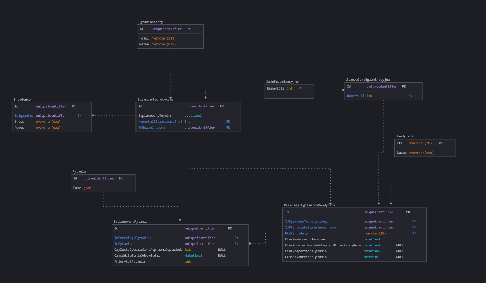

# Specyfikacja wymagań procesu: Przeprowadzenie egzaminu teoretycznego

## Generalny opis procesu

### Opis procesu

Proces przeprowadzenia egzaminu teoretycznego składa się z następujących kroków:

- Kandydat wybiera dostępny termin egzaminu teoretycznego oraz rejestruje się na egzamin.
- Kandydat przychodzi na egzamin w wyznaczonym terminie.
- Kandydat podchodzi do egzaminu na komputerze stacjonarnym w sali w towarzystwie innych kandydatów pod nadzorem egzaminatora.
- W momencie gdy zostanie zakończony przez wszystkich obecnych na sali kandydatów, system automatycznie ocenia testy, pokazuje kandydatowi wynik oraz egzaminator drukuje zaświadczenia o wyniku egzaminu.
- Kandydat otrzymuje wynik egzaminu oraz zaświadczenie o wyniku egzaminu.
- W przypadku nieprawidłowości w przebiegu egzaminu, kandydat ma prawo złożyć skargę poprzez wypełnienie formularza w okienku recepcji.

Cele dot. procesu:

- **Zmniejszenie średniego czasu oczekiwania na termin egzaminu teoretycznego o nie mniej niż 3% miesięcznie w porównaniu do poprzedniego miesiąca przez okres następnych 18 miesięcy**
- **Zmniejszenie liczby skarg dot. przebiegu egzaminu teoretycznego o min 75% w skali najbliższych 18 miesięcy (z 500 do mniej niż, lub równo 125)**

### Pytania analityczne

### Źródła danych

Dane dotyczące przebiegu egzaminu teoretycznego są przechowywane w bazie danych systemu przeprowadzania egzaminów teoretycznych. System przechowuje informacje o kandydatach, egzaminatorach, wynikach egzaminów oraz czasie / terminie jego przeprowadzenia. Przechowywane są również informacje o incydentach, które miały miejsce podczas egzaminu.

Skargi dot. procesu egzaminacyjnego są przepisywane z formularzy skargowych do pliku excel przez pracownika recepcji. Plik ten rotowany jest co miesiąc oraz przekazywany do kierownictwa co 2 tygodnie.

## Struktury w źródłach danych

### Baza danych systemu przeprowadzania egzaminów teoretycznych

// TODO: Uzupełnić tabelę po weryfikacji przez prowadzącego

// ERRATA: `ZaplanowanePytanieNaEgzaminTeoretyczny` powinno mieć atrybut `Id` zamiast klucza kompozytowego

| Nazwa tabeli | Atrybut | Typ atrybutu | Opis |
| ------------ | ------- | ------------ | ---- |
|              |         |              |      |
|              |         |              |      |

### Plik excel z danymi dot. skarg

_Arkusz 1_ - Skargi dot. procesu egzaminacyjnego.

- Kolumna A - PKK Kantydanta (20 cyfrowy numer identyfikacyjny)
- Kolumna B - Pesel Egzaminatora (11 cyfrowy numer identyfikacyjny)
- Kolumna C - Termin egzaminu (data i godzina w formacie dd-mm-yyyy hh:mm)
- Kolumna D - Typ egzaminu (tekst "teoretyczny" lub "praktyczny")
- Kolumna E - Typ skargi (tekst "związana z technicznym przebiegiem egzaminu", "związana z treścią pytań", "związana z egzaminatorem", "inne")
- Kolumna F - Treść skargi (tekst)
- Kolumna G - Data złożenia skargi (data w formacie dd-mm-yyyy)

Kolejne wiersze zawierają kolejne skargi. Skargi są zapisywane w pliku w kolejności ich złożenia. Nowy plik z danymi skarg jest tworzony co miesiąc, a stary przechowywany jest w archiwum.

_Arkusz 2_ - Lista egzaminatorów

- Kolumna A - Pesel Egzaminatora (11 cyfrowy numer identyfikacyjny)
- Kolumna B - Imię i nazwisko egzaminatora (tekst)

Kolejne wiersze zawierają kolejne wpisy dot. egzaminatorów. Dane aktualizowane są w miarę zmian w zespole egzaminatorów i przekopiowywane co miesiąc.

## Scenariusze problemów analitycznych

- **Problem 1**: Dlaczego nastąpił spadek/wzrost średniego czasu oczekiwania na termin egzaminu teoretycznego w porównaniu do poprzedniego miesiąca?
    1. Porównaj średnią liczbę zarezerwowanych terminów egzaminów teoretycznych na przestrzeni dni tygodnia w tym i poprzednim miesiącu.
    2. Podaj jak dużo kandydatów nie pojawiło się na egzaminie w tym i poprzednim miesiącu.
    3. Porównaj liczbę incydentów podczas egzaminów w tym i poprzednim miesiącu.
    4. Jak dużo terminów egzaminów zostało w pełni zarezerwowanych w tym i poprzednim miesiącu?
    5. Jaka jest średnia liczba podejść do egzaminu na jednego kandydata w tym i poprzednim miesiącu?
    6. Czy istnieje zapotrzebowanie na dodatkowe terminy egzaminów w okolicy świąt (Boże Narodzenie, Wielkanoc)? (czy stopień zarezerwowanych terminów 2 dni do przodu i do tyłu święta jest powyżej 70%) [DODATKOWE ZEW. DANE]
    7. Jaki jest średni czas między zarezerwowaniem terminu a jego odbyciem się w tym i poprzednim miesiącu? [ZMIANA W PROCESIE BIZNESOWYM - dodanie info o czasie rezerwacji terminu]

- **Problem 2**: Jakie są najczęstsze problemy związane z przebiegiem egzaminu teoretycznego?
    1. Porównaj liczbę skarg technicznych w relacji do sal w których odbywają się egzaminy.
    2. Jakie pytania pojawiały się najczęściej w egzaminach do których złożono skargi związane z treścią pytań?
    3. Jacy egzaminatorzy byli najczęściej związani ze złożeniem skargi?
    4. Podaj liczbę skarg złożonych w egzaminach w których nie wystąpiły żadne incydenty.
    5. Jak dużo kandydatów nie zdołało odpowiedzieć na wszystkie pytania w egzaminie i złożyło skargę z kategorii "związana z treścią pytań" lub "inne"?

## Dane potrzebne do problemów analitycznych

- **Problem 1**: Dlaczego nastąpił spadek/wzrost średniego czasu oczekiwania na termin egzaminu teoretycznego w porównaniu do poprzedniego miesiąca?
    1. Liczba zarezerwowanych terminów egzaminów teoretycznych na przestrzeni dni tygodnia w tym i poprzednim miesiącu.
        - **termin egzaminu** - _Baza Danych_, tabela `EgzaminyTeoretyczne`, atrybut `ZaplanowanyTermin`
        - **liczba zarezerwowanych miejsc na egzaminie** - _Baza Danych_, liczba powiązanych z egzaminem `PrzebiegówEgzaminuKandydata`
    2. Liczba kandydatów niepojawiających się na egzaminie w tym i poprzednim miesiącu.
        - **termin egzaminu** - _Baza Danych_, tabela `EgzaminyTeoretyczne`, atrybut `ZaplanowanyTermin`
        - **liczba kandydatów którzy nie pojawili się na egzaminie** - _Baza Danych_, liczba powiązanych z egzaminem `PrzebiegówEgzaminuKandydata` gdzie atrybut `CzasPotwierdzeniaGotowsciPrzezKandydata` jest pusty
    3. Liczba incydentów podczas egzaminów w tym i poprzednim miesiącu.
        - **termin egzaminu** - _Baza Danych_, tabela `EgzaminyTeoretyczne`, atrybut `ZaplanowanyTermin`
        - **liczba incydentów podczas egzaminu** - _Baza Danych_, liczba powiązanych z egzaminem `IncydentówPodczasEgzaminu`
    4. Liczba terminów egzaminów w pełni zarezerwowanych w tym i poprzednim miesiącu.
        - **termin egzaminu** - _Baza Danych_, tabela `EgzaminyTeoretyczne`, atrybut `ZaplanowanyTermin`
        - **liczba zarezerwowanych miejsc na egzaminie** - _Baza Danych_, liczba powiązanych z egzaminem `PrzebiegówEgzaminuKandydata`
        - **maksymalna liczba miejsc na egzaminie** - _Baza Danych_, liczba `StanowiskEgzaminacyjnych` w przypisanej do egzaminu `SaliEgzaminacyjnej`
    5. Średnia liczba podejść do egzaminu na jednego kandydata w tym i poprzednim miesiącu.
        - **termin egzaminu** - _Baza Danych_, tabela `EgzaminyTeoretyczne`, atrybut `ZaplanowanyTermin`
        - **liczba podejść do egzaminu** - _Baza Danych_, liczba powiązanych z kandydatów `PrzebiegówEgzaminuKandydata` gdzie atrybut `CzasZakonczeniaEgzaminu` jest pusty
    6. Zapotrzebowanie na dodatkowe terminy egzaminów w okolicy świąt (Boże Narodzenie, Wielkanoc).
        - **termin egzaminu** - _Baza Danych_, tabela `EgzaminyTeoretyczne`, atrybut `ZaplanowanyTermin`
        - **liczba zarezerwowanych miejsc na egzaminie** - _Baza Danych_, liczba powiązanych z egzaminem `PrzebiegówEgzaminuKandydata`
        - **maksymalna liczba miejsc na egzaminie** - _Baza Danych_, liczba `StanowiskEgzaminacyj
        - **święta** - Kalendarz świąt, który musi być dostarczony z zewnątrz np. z Google Calendar'a.
    7. Średni czas między zarezerwowaniem terminu a jego odbyciem się w tym i poprzednim miesiącu.
        - **termin egzaminu** - _Baza Danych_, tabela `EgzaminyTeoretyczne`, atrybut `ZaplanowanyTermin`
        - **czas rezerwacji terminu** - Brak jest takiej informacji w bazie danych, należy dodać nowy atrybut `CzasRezerwacjiTerminu` do tabeli `PrzebiegEgzaminuKandydata`, który zostanie uzupełniany w momencie rezerwacji terminu, co wymaga zmian w procesie biznesowym.
        - **czas odbycia się egzaminu** - _Baza Danych_, atrybut `CzasPotwierdzeniaGotowosciPrzezKandydata` w tabeli `PrzebiegEgzaminuKandydata`
        
- **Problem 2**: Jakie są najczęstsze problemy związane z przebiegiem egzaminu teoretycznego?
    1. Liczba skarg technicznych w relacji do sal w których odbywają się egzaminy.
        - **salę egzaminacyjną** - _Baza Danych_, tabela `SaleEgzaminacyjne`, atrybut `NumberSali`
        - **termin egzaminu** - _Plik Excel_, arkusz `Arkusz 1`, kolumna `ZaplanowanyTermin`
        - **pesel egzaminatora** - _Plik Excel_, arkusz `Arkusz 1`, kolumna `PeselEgzaminatora`
        - **typ skargi** - _Plik Excel_, arkusz `Arkusz 1`, kolumna `TypSkargi`
    2. Najczęściej pojawiające się pytania w egzaminach do których złożono skargi związane z treścią pytań.
        - **id pytania** - _Baza Danych_, tabela `PytaniaNaEgzaminTeoretyczny`, atrybut `Id`
        - **pkk kandydata** - _Plik Excel_, arkusz `Arkusz 1`, kolumna `PKK Kandydata`
        - **termin egzaminu** - _Plik Excel_, arkusz `Arkusz 1`, kolumna `ZaplanowanyTermin`
        - **pesel egzaminatora** - _Plik Excel_, arkusz `Arkusz 1`, kolumna `PeselEgzaminatora`
        - **typ skargi** - _Plik Excel_, arkusz `Arkusz 1`, kolumna `TypSkargi`
    3. Egzaminatorzy związani ze złożeniem skargi.
        - **typ skargi** - _Plik Excel_, arkusz `Arkusz 1`, kolumna `TypSkargi`
        - **pesel egzaminatora** - _Plik Excel_, arkusz `Arkusz 1`, kolumna `PeselEgzaminatora`
    4. Liczba skarg złożonych w egzaminach w których nie wystąpiły żadne incydenty.
        - **incydenty podczas egzaminu** - _Baza Danych_, tabela `IncydentyPodczasEgzaminu`, atrybut `Id`
        - **termin egzaminu** - _Plik Excel_, arkusz `Arkusz 1`, kolumna `ZaplanowanyTermin`
        - **pesel egzaminatora** - _Plik Excel_, arkusz `Arkusz 1`, kolumna `PeselEgzaminatora`
    5. Kandydaci nie zdołali odpowiedzieć na wszystkie pytania w egzaminie i złożyli skargę z kategorii "związana z treścią pytań" lub "inne".
        - **typ skargi** - _Plik Excel_, arkusz `Arkusz 1`, kolumna `TypSkargi`
        - **pkk kandydata** - _Plik Excel_, arkusz `Arkusz 1`, kolumna `PKK Kandydata`
        - **termin egzaminu** - _Plik Excel_, arkusz `Arkusz 1`, kolumna `ZaplanowanyTermin`
        - **pesel egzaminatora** - _Plik Excel_, arkusz `Arkusz 1`, kolumna `PeselEgzaminatora`
        - **priorytet pytania** - _Baza Danych_, tabela `ZaplanowanePytanieNaEgzaminTeoretyczny`, atrybut `Priorytet`
        - **czy kandydat odpowiedział na pytanie** - _Baza Danych_, tabela `ZaplanowanePytanieNaEgzaminTeoretyczny`, atrybut `CzasUdzieleniaOdpowiedzi`
        - **liczba pytań** - _Baza Danych_, liczba rzędów w tabeli `ZaplanowanePytanieNaEgzaminTeoretyczny` powiązanych z `PrzebiegiemEgzaminuKandydata`

## Wymagane zmiany w procesie biznesowym

Aktualnie w procesie biznesowym brakuje informacji o czasie rezerwacji terminu egzaminu. Aby móc odpowiedzieć na pytanie analityczne dot. średniego czasu między zarezerwowaniem terminu a jego odbyciem się, należy dodać nowy atrybut `CzasRezerwacjiTerminu` (`datetime2`) do tabeli `PrzebiegEgzaminuKandydata`, który zostanie uzupełniany w momencie rezerwacji terminu.
